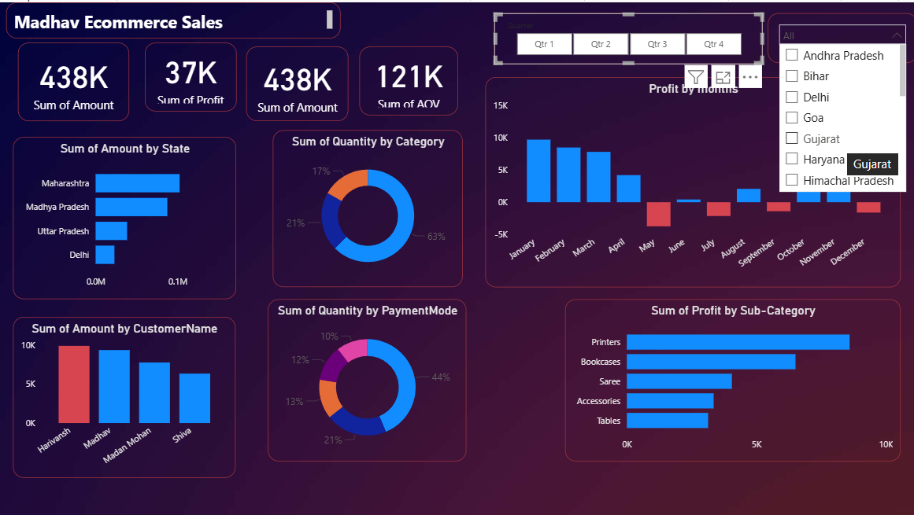

# 📊 Madhav Ecommerce Sales Dashboard

An interactive Power BI dashboard built to analyze e-commerce sales performance — tracking revenue, profit, and customer behavior across states, categories, and payment modes.




---

## 🎯 Objective

E-commerce businesses generate large volumes of transactional data daily. This dashboard was built to turn that raw data into clear, actionable insights — helping identify top-performing states, products, and customer segments, and track profit trends over time.

---

## 🛠️ Tools & Technologies

- **Power BI Desktop** – Dashboard design & data modeling
- **DAX** – Custom measures (Sum of Amount, Profit, AOV)
- **Power Query** – Data cleaning & transformation
- **Excel / CSV** – Source data

---

## 📈 Key Features

- **KPI Cards** – Sum of Amount, Sum of Profit, Sum of AOV at a glance
- **Quarter & Category Slicers** – Dynamic filtering across the entire report
- **Sum of Amount by State** – Bar chart showing regional sales performance
- **Sum of Quantity by Category** – Donut chart of product category mix
- **Sum of Quantity by Payment Mode** – Breakdown of preferred payment methods
- **Profit by Months** – Trend chart highlighting seasonal profit/loss months
- **Sum of Profit by Sub-Category** – Identifies most and least profitable product lines
- **Drill-through Tooltips** – Hover on any state to see exact sales figures

---

## 🔍 Key Insights

- **Maharashtra** contributes the largest share of sales among all states — around **63%** of category-wise sales
- **May, September, and December** show notable **profit dips**, while **November** stands out as the strongest profit month
- **Printers and Bookcases** are the top profit-generating sub-categories
- Majority of orders are paid via a small number of preferred payment modes, led by one method at **44%**

---

## 📂 Repository Structure

```
├── README.md
├── screenshots/
│   └── dashboard-overview.png
    └── Dashboard-overview-2.png
├── data/
│   └── Details.csv
    └── Orders.csv
└── shop sales.pbix
```

---

## 🚀 How to Use

1. Clone or download this repository
2. Open `shop sales.pbix` in **Power BI Desktop**
3. Use the Quarter and Category slicers to explore the data interactively

---

## 📌 Note

The dataset used in this project is for **learning and demonstration purposes**.

---

## 👤 Author

**Vikas Singh Rathore**
📧 vikassrathore123@gmail.com
🔗 [https://www.linkedin.com/in/vikassrathore/](#)
